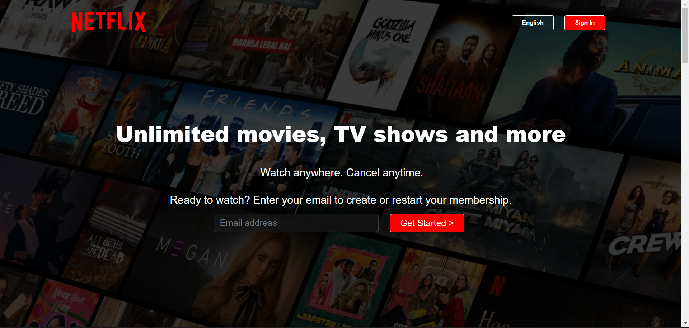

## NETFLIX-Clone
Created Netflix Clone using HTML and CSS only. link: https://hansrajs1.github.io/NETFLIX-Clone/

Clone Site Project

The Clone Site Project is a static website built with pure HTML and CSS. It serves as a practice for HTML/CSS skills and aims to mimic the look and feel of an existing website. This project does not include any interactive features that would require JavaScript, focusing solely on the visual aspects.

Thank you for checking out the Clone Site Project! If you have any questions or feedback, please feel free to reach out.

Happy coding!

## License
[MIT License](LICENSE)
